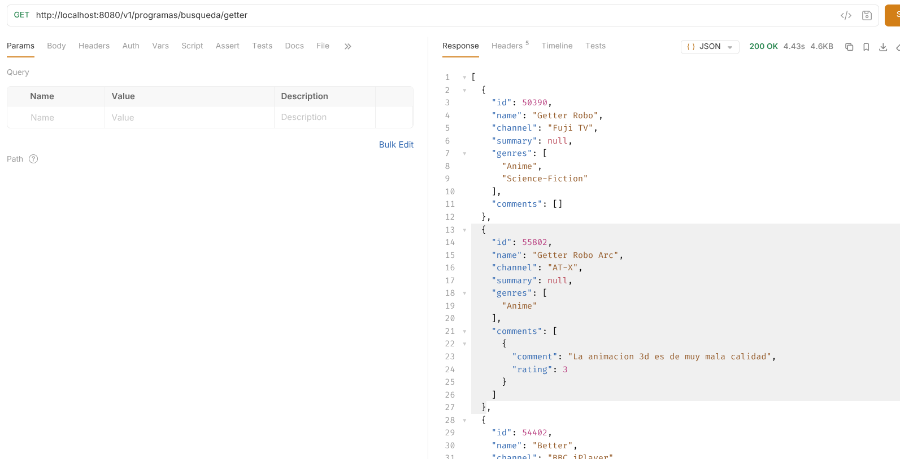
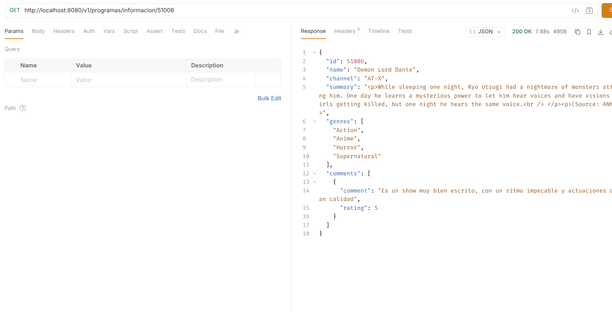
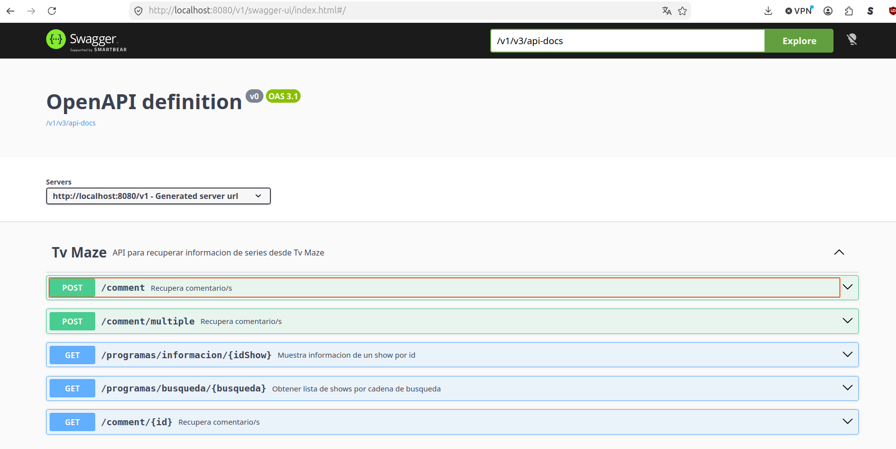

# tvmaze

Prueba de consulta de datos a tvmaze

Se cambia la ruta por default de los enpots agregandole
**/v1** a todas las rutas 
y el puerto **8080** se 
coloco de manera explicita

## Enpoints

### Shows

* **GET**  /v1/programas/busqueda/{busqueda}

* **GET** /v1/programas/informacion/{idShow}

### Comments

* **GET** /v1/comment/{idShow}

* **POST** /v1/comment

* **POST** /v1/comment/multiple 


## Pruebas

Se hicieron varias pruebas con diferentes Id's
y palabras pero en estos dos se encontrara 
informacion ya cargada en mongoDB, aunque en el primero
 solo en uno de los shows recuperados

### Search

El endpoint para la busqueda es **/v1/programas/busqueda/**
la palabra buscada fue *"getter"*



### Info show

El endpoint para la informacion de  un show 
es **/v1/programas/informacion/** el id que se
uso en las pruebas es *51006*





## Swagger

Se cambia 



### api-docs

```json
{"openapi":"3.1.0","info":{"title":"OpenAPI definition","version":"v0"},"servers":[{"url":"http://localhost:8080/v1","description":"Generated server url"}],"tags":[{"name":"Tv Maze","description":"API para recuperar informacion de series desde Tv Maze"}],"paths":{"/comment":{"post":{"tags":["Tv Maze"],"summary":"Recupera comentario/s","description":"Recupera uno o mas comentarios a partir del Id de un show.","operationId":"saveComment","requestBody":{"content":{"application/json":{"schema":{"$ref":"#/components/schemas/Comment Request"}}},"required":true},"responses":{"200":{"description":"Comentario creado Exitosamente","content":{"application/json":{"schema":{"$ref":"#/components/schemas/Show"}}}},"204":{"description":"No se pudo crear el comentario"},"400":{"description":"Fallo al guardar el comentario","content":{"application/json":{"schema":{"$ref":"#/components/schemas/ErrorResponse"}}}},"500":{"description":"Error interno del servidor","content":{"application/json":{"schema":{"$ref":"#/components/schemas/ErrorResponse"}}}}}}},"/comment/multiple":{"post":{"tags":["Tv Maze"],"summary":"Recupera comentario/s","description":"Recupera uno o mas comentarios a partir deuna lista de Id's de uno o vaiors shows.","operationId":"saveComment_1","requestBody":{"content":{"application/json":{"schema":{"type":"array","items":{"type":"integer","format":"int32"}}}},"required":true},"responses":{"200":{"description":"Se encontraron comentarios de uno o mas shows solicitados","content":{"application/json":{"schema":{"$ref":"#/components/schemas/Show"}}}},"204":{"description":"No se encontraron comentarios"},"400":{"description":"Fallo al recuperar los comentarios","content":{"application/json":{"schema":{"$ref":"#/components/schemas/ErrorResponse"}}}},"500":{"description":"Error interno del servidor","content":{"application/json":{"schema":{"$ref":"#/components/schemas/ErrorResponse"}}}}}}},"/programas/informacion/{idShow}":{"get":{"tags":["Tv Maze"],"summary":"Muestra informacion de un show por id","description":"Muestra informacion de un show por id","operationId":"informacionShow","parameters":[{"name":"idShow","in":"path","required":true,"schema":{"type":"integer","format":"int32"}}],"responses":{"200":{"description":"Muestra informacion de un show por id","content":{"application/json":{"schema":{"$ref":"#/components/schemas/Show"}}}},"404":{"description":"Show no encontrado","content":{"application/json":{"schema":{"$ref":"#/components/schemas/ErrorResponse"}}}},"400":{"description":"ID inválido","content":{"application/json":{"schema":{"$ref":"#/components/schemas/ErrorResponse"}}}},"500":{"description":"Error interno del servidor","content":{"application/json":{"schema":{"$ref":"#/components/schemas/ErrorResponse"}}}}}}},"/programas/busqueda/{busqueda}":{"get":{"tags":["Tv Maze"],"summary":"Obtener lista de shows por cadena de busqueda","description":"Devuelve una lista de show con la palapra o palabra clave solicitadas","operationId":"buscaShows","parameters":[{"name":"busqueda","in":"path","required":true,"schema":{"type":"string"}}],"responses":{"200":{"description":"Lista de shows por palabra/s clave","content":{"application/json":{"schema":{"$ref":"#/components/schemas/Show"}}}},"204":{"description":"No se encontraron shows con los fase solicitada"},"400":{"description":"Parámetro de búsqueda inválido, favor de probar otra palabra","content":{"application/json":{"schema":{"$ref":"#/components/schemas/ErrorResponse"}}}},"500":{"description":"Error interno del servidor","content":{"application/json":{"schema":{"$ref":"#/components/schemas/ErrorResponse"}}}}}}},"/comment/{id}":{"get":{"tags":["Tv Maze"],"summary":"Recupera comentario/s","description":"Recupera uno o mas comentarios a partir del Id de un show.","operationId":"getFromSingleID","parameters":[{"name":"id","in":"path","required":true,"schema":{"type":"integer","format":"int32"}}],"responses":{"201":{"description":"Recuperado exitosamente","content":{"*/*":{"schema":{"$ref":"#/components/schemas/Show"}}}},"204":{"description":"No se encontraron shows con los fase solicitada"}}}}},"components":{"schemas":{"Comment Request":{"type":"object","description":"Peticion para crear un nuevo comentario para un show","properties":{"id":{"type":"integer","format":"int32","description":"ID único del show en TVMaze","example":51006},"comment":{"type":"string","description":"Comentario sobre el show","example":"Es un show muy bien escrito, con un ritmo impecable y actuaciones de gran calidad"},"rating":{"type":"integer","format":"int32","description":"Nota del show","example":5,"maximum":5,"minimum":0}},"required":["comment","id","rating"]},"Show":{"type":"object","description":"Información resumida de un show de televisión obtenido desde TVMaze","properties":{"comment":{"type":"string","description":"Es un show muy bien escrito, con un ritmo impecable y actuaciones de gran calidad","example":"51006"},"rating":{"type":"integer","format":"int32","description":"Nota del show","example":5}}},"ContentDisposition":{"type":"object","properties":{"type":{"type":"string"},"name":{"type":"string"},"filename":{"type":"string"},"charset":{"type":"string"},"formData":{"type":"boolean"},"attachment":{"type":"boolean"},"inline":{"type":"boolean"}}},"DefaultHttpStatusCode":{"allOf":[{"$ref":"#/components/schemas/HttpStatusCode"}]},"ErrorResponse":{"type":"object","properties":{"body":{"$ref":"#/components/schemas/ProblemDetail"},"statusCode":{"oneOf":[{"$ref":"#/components/schemas/DefaultHttpStatusCode"},{"$ref":"#/components/schemas/HttpStatus"}]},"detailMessageArguments":{"type":"array","items":{}},"typeMessageCode":{"type":"string"},"detailMessageCode":{"type":"string"},"titleMessageCode":{"type":"string"},"headers":{"$ref":"#/components/schemas/HttpHeaders"}}},"HttpHeaders":{"type":"object","properties":{"host":{"type":"object","properties":{"hostString":{"type":"string"},"address":{"type":"object","properties":{"hostAddress":{"type":"string"},"address":{"type":"string","format":"byte"},"hostName":{"type":"string"},"linkLocalAddress":{"type":"boolean"},"multicastAddress":{"type":"boolean"},"anyLocalAddress":{"type":"boolean"},"loopbackAddress":{"type":"boolean"},"siteLocalAddress":{"type":"boolean"},"mcglobal":{"type":"boolean"},"mcnodeLocal":{"type":"boolean"},"mclinkLocal":{"type":"boolean"},"mcsiteLocal":{"type":"boolean"},"mcorgLocal":{"type":"boolean"},"canonicalHostName":{"type":"string"}}},"port":{"type":"integer","format":"int32"},"unresolved":{"type":"boolean"},"hostName":{"type":"string"}}},"location":{"type":"string","format":"uri"},"contentDisposition":{"$ref":"#/components/schemas/ContentDisposition"},"acceptCharset":{"type":"array","items":{"type":"string"}},"empty":{"type":"boolean"},"all":{"type":"object","additionalProperties":{"type":"string"},"writeOnly":true},"lastModified":{"type":"integer","format":"int64"},"date":{"type":"integer","format":"int64"},"contentLength":{"type":"integer","format":"int64"},"origin":{"type":"string"},"range":{"type":"array","items":{"$ref":"#/components/schemas/HttpRange"}},"allow":{"type":"array","items":{"$ref":"#/components/schemas/HttpMethod"},"uniqueItems":true},"cacheControl":{"type":"string"},"contentLanguage":{"type":"string"},"etag":{"type":"string"},"accept":{"type":"array","items":{"$ref":"#/components/schemas/MediaType"}},"acceptLanguageAsLocales":{"type":"array","items":{"type":"string"}},"acceptPatch":{"type":"array","items":{"$ref":"#/components/schemas/MediaType"}},"accessControlAllowCredentials":{"type":"boolean"},"accessControlAllowHeaders":{"type":"array","items":{"type":"string"}},"accessControlAllowMethods":{"type":"array","items":{"$ref":"#/components/schemas/HttpMethod"}},"accessControlAllowOrigin":{"type":"string"},"accessControlExposeHeaders":{"type":"array","items":{"type":"string"}},"accessControlMaxAge":{"type":"integer","format":"int64"},"accessControlRequestHeaders":{"type":"array","items":{"type":"string"}},"accessControlRequestMethod":{"$ref":"#/components/schemas/HttpMethod"},"bearerAuth":{"type":"string","writeOnly":true},"connection":{"type":"array","items":{"type":"string"}},"expires":{"type":"integer","format":"int64"},"ifMatch":{"type":"array","items":{"type":"string"}},"ifNoneMatch":{"type":"array","items":{"type":"string"}},"ifUnmodifiedSince":{"type":"integer","format":"int64"},"pragma":{"type":"string"},"upgrade":{"type":"string"},"vary":{"type":"array","items":{"type":"string"}},"acceptLanguage":{"type":"array","items":{"type":"object","properties":{"range":{"type":"string"},"weight":{"type":"number","format":"double"}}}},"basicAuth":{"type":"string","writeOnly":true},"ifModifiedSince":{"type":"integer","format":"int64"},"contentType":{"$ref":"#/components/schemas/MediaType"}}},"HttpMethod":{},"HttpRange":{},"HttpStatus":{"allOf":[{"$ref":"#/components/schemas/HttpStatusCode"}],"enum":["100 CONTINUE","101 SWITCHING_PROTOCOLS","102 PROCESSING","103 EARLY_HINTS","200 OK","201 CREATED","202 ACCEPTED","203 NON_AUTHORITATIVE_INFORMATION","204 NO_CONTENT","205 RESET_CONTENT","206 PARTIAL_CONTENT","207 MULTI_STATUS","208 ALREADY_REPORTED","226 IM_USED","300 MULTIPLE_CHOICES","301 MOVED_PERMANENTLY","302 FOUND","303 SEE_OTHER","304 NOT_MODIFIED","307 TEMPORARY_REDIRECT","308 PERMANENT_REDIRECT","400 BAD_REQUEST","401 UNAUTHORIZED","402 PAYMENT_REQUIRED","403 FORBIDDEN","404 NOT_FOUND","405 METHOD_NOT_ALLOWED","406 NOT_ACCEPTABLE","407 PROXY_AUTHENTICATION_REQUIRED","408 REQUEST_TIMEOUT","409 CONFLICT","410 GONE","411 LENGTH_REQUIRED","412 PRECONDITION_FAILED","413 CONTENT_TOO_LARGE","413 PAYLOAD_TOO_LARGE","414 URI_TOO_LONG","415 UNSUPPORTED_MEDIA_TYPE","416 REQUESTED_RANGE_NOT_SATISFIABLE","417 EXPECTATION_FAILED","418 I_AM_A_TEAPOT","421 MISDIRECTED_REQUEST","422 UNPROCESSABLE_CONTENT","422 UNPROCESSABLE_ENTITY","423 LOCKED","424 FAILED_DEPENDENCY","425 TOO_EARLY","426 UPGRADE_REQUIRED","428 PRECONDITION_REQUIRED","429 TOO_MANY_REQUESTS","431 REQUEST_HEADER_FIELDS_TOO_LARGE","451 UNAVAILABLE_FOR_LEGAL_REASONS","500 INTERNAL_SERVER_ERROR","501 NOT_IMPLEMENTED","502 BAD_GATEWAY","503 SERVICE_UNAVAILABLE","504 GATEWAY_TIMEOUT","505 HTTP_VERSION_NOT_SUPPORTED","506 VARIANT_ALSO_NEGOTIATES","507 INSUFFICIENT_STORAGE","508 LOOP_DETECTED","509 BANDWIDTH_LIMIT_EXCEEDED","510 NOT_EXTENDED","511 NETWORK_AUTHENTICATION_REQUIRED"]},"HttpStatusCode":{"type":"object","properties":{"error":{"type":"boolean"},"is4xxClientError":{"type":"boolean"},"is5xxServerError":{"type":"boolean"},"is1xxInformational":{"type":"boolean"},"is2xxSuccessful":{"type":"boolean"},"is3xxRedirection":{"type":"boolean"}}},"MediaType":{"type":"object","properties":{"type":{"type":"string"},"subtype":{"type":"string"},"parameters":{"type":"object","additionalProperties":{"type":"string"}},"qualityValue":{"type":"number","format":"double"},"concrete":{"type":"boolean"},"wildcardType":{"type":"boolean"},"wildcardSubtype":{"type":"boolean"},"subtypeSuffix":{"type":"string"},"charset":{"type":"string"}}},"ProblemDetail":{"type":"object","properties":{"type":{"type":"string","format":"uri"},"title":{"type":"string"},"status":{"type":"integer","format":"int32"},"detail":{"type":"string"},"instance":{"type":"string","format":"uri"},"properties":{"type":"object","additionalProperties":{}}}}}}}
```